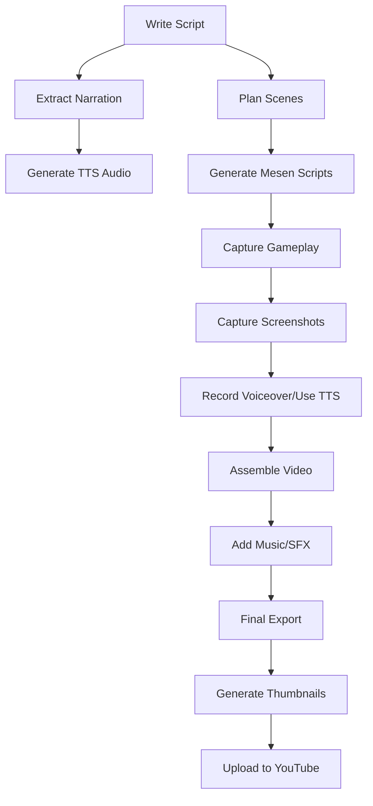

# Video Production Guide

> Comprehensive documentation for producing Dragon Warrior ROM Hacking tutorial videos

This guide covers the complete video production pipeline from script to upload,
using automated tools and AI-assisted workflows.

## Table of Contents

1. [Overview](#overview)
2. [Prerequisites](#prerequisites)
3. [Production Pipeline](#production-pipeline)
4. [Tool Reference](#tool-reference)
5. [Mesen Automation](#mesen-automation)
6. [AI Narration](#ai-narration)
7. [Video Assembly](#video-assembly)
8. [Quality Checklist](#quality-checklist)
9. [Troubleshooting](#troubleshooting)

---

## Overview

### Video Series Structure

The Dragon Warrior ROM Hacking tutorial series consists of 7 episodes:

| Episode | Title | Duration | Focus |
|---------|-------|----------|-------|
| 1 | Getting Started | 8-10 min | Setup, tools, first steps |
| 2 | Monster Stats | 10-12 min | Data tables, hex editing |
| 3 | Graphics Editing | 12-15 min | CHR editing, tiles, palettes |
| 4 | Dialog Editing | 10-12 min | Text encoding, dialog tables |
| 5 | Game Balance | 15-18 min | Stats, formulas, play testing |
| 6 | Advanced Assembly | 20-25 min | 6502, code modification |
| 7 | Troubleshooting | 12-15 min | Debugging, common problems |

### Production Workflow



---

## Prerequisites

### Required Software

| Software | Purpose | Download |
|----------|---------|----------|
| **Mesen** | NES emulation, Lua scripting | [mesen.ca](https://mesen.ca) |
| **OBS Studio** | Screen recording | [obsproject.com](https://obsproject.com) |
| **FFmpeg** | Video processing | [ffmpeg.org](https://ffmpeg.org) |
| **Python 3.8+** | Automation scripts | [python.org](https://python.org) |

### Optional Software

| Software | Purpose | Download |
|----------|---------|----------|
| DaVinci Resolve | Video editing | [blackmagicdesign.com](https://www.blackmagicdesign.com/products/davinciresolve) |
| Audacity | Audio editing | [audacityteam.org](https://www.audacityteam.org) |
| GIMP/Photoshop | Thumbnails | [gimp.org](https://www.gimp.org) |

### Python Dependencies

```bash
pip install -r requirements.txt
```

Required packages:

- `pyyaml` - YAML configuration parsing
- `Pillow` - Image processing for thumbnails
- `requests` - API calls for TTS services

### Directory Structure

```
video_production/
├── scripts/           # Episode markdown scripts
├── narration/         # Extracted narration text
├── mesen_scripts/     # Generated Lua scripts
├── recordings/        # Raw gameplay captures
├── audio/             # Narration and music
├── thumbnails/        # Generated thumbnails
├── projects/          # Video assembly projects
└── output/            # Final rendered videos
```

---

## Production Pipeline

### Phase 1: Script Preparation

#### 1.1 Finalize Episode Script

Ensure the script in `docs/video_scripts/` is complete:

```bash
# Validate markdown
markdownlint docs/video_scripts/episode_01_getting_started.md
```

#### 1.2 Extract Narration

```bash
python -m tools.video.extract_narration \
    docs/video_scripts/episode_01_getting_started.md \
    --output narration/episode_01.txt \
    --format teleprompter
```

Output formats:

- `teleprompter` - Plain text with pacing markers
- `json` - Structured data for programmatic use
- `ssml` - Speech Synthesis Markup Language for TTS

#### 1.3 Generate Scene Plan

```bash
python -m tools.video.scene_planner \
    docs/video_scripts/episode_01_getting_started.md \
    --format all \
    --output scene_plans/
```

This creates:

- `episode_01_scenes.json` - Scene definitions
- `episode_01_scenes.csv` - Spreadsheet for planning
- `episode_01_timeline.txt` - Visual timeline

### Phase 2: Gameplay Capture

#### 2.1 Generate Mesen Scripts

```bash
python -m tools.video.mesen_automation generate-scripts \
    --episode 1 \
    --output video_assets/mesen_scripts/
```

This generates Lua scripts for each scene:

- `title_screen.lua` - Title display capture
- `new_game_start.lua` - New game sequence
- `battle_detector.lua` - Auto-capture battles
- `video_overlay.lua` - Tutorial annotations
- `run_all_scenes.lua` - Master runner script

#### 2.2 Prepare Save States

Create save states at key points:

| Save State | Description | Slot |
|------------|-------------|------|
| `title.mss` | At title screen | 1 |
| `throne_room.mss` | After character creation | 2 |
| `overworld.mss` | First steps outside castle | 3 |
| `slime_battle.mss` | Encounter with slime | 4 |
| `brecconary.mss` | In town near shop | 5 |

#### 2.3 Run Automated Capture

1. Open Mesen with Dragon Warrior ROM
2. Load the appropriate save state
3. Load the Lua script:
   - Tools → Lua Scripts → Open Script
   - Select the scene script
4. Scripts auto-capture screenshots to `ScriptData/{scene_name}/`

#### 2.4 Manual Recording (OBS)

For longer sequences requiring human playthrough:

1. Configure OBS:
   - Video: 1920x1080, 60fps
   - Audio: Game capture + Microphone
   - Format: MKV (convert to MP4 after)

2. Recording checklist:
   - [ ] Save state loaded
   - [ ] Mesen window maximized/fullscreen
   - [ ] Audio levels set (-6dB peak)
   - [ ] Recording started
   - [ ] Perform the gameplay sequence
   - [ ] Stop recording

### Phase 3: Audio Production

#### 3.1 AI-Generated Narration (TTS)

Using ElevenLabs API:

```python
from elevenlabs import generate, save

narration_text = open("narration/episode_01.txt").read()

audio = generate(
    text=narration_text,
    voice="Antoni",  # Or custom voice
    model="eleven_multilingual_v2"
)

save(audio, "audio/episode_01_narration.mp3")
```

#### 3.2 Human Voice Recording

1. Read from teleprompter output
2. Record in quiet environment
3. Export as WAV, 48kHz, mono

#### 3.3 Audio Processing

```bash
# Normalize audio
ffmpeg -i narration_raw.wav -af loudnorm=I=-16:TP=-1.5:LRA=11 narration.wav

# Add light compression
ffmpeg -i narration.wav -af "acompressor=threshold=0.1:ratio=4" narration_processed.wav
```

### Phase 4: Video Assembly

#### 4.1 Create Project File

```bash
python -m tools.video.video_assembler \
    --create-project episode_01 \
    --output video_production/projects/
```

Edit `episode_01_project.json`:

```json
{
  "name": "episode_01",
  "output_path": "output/episode_01_final.mp4",
  "resolution": "1920x1080",
  "frame_rate": 30,
  "video_clips": [
    {
      "source_path": "recordings/ep01_intro.mp4",
      "clip_type": "title_card",
      "start_time": 0,
      "duration": 5,
      "fade_in": 0.5
    },
    {
      "source_path": "recordings/ep01_gameplay_01.mp4",
      "clip_type": "gameplay",
      "start_time": 5,
      "duration": 120,
      "source_in": 10,
      "source_out": 130
    }
  ],
  "audio_tracks": [
    {
      "source_path": "audio/narration.wav",
      "track_type": "narration",
      "start_time": 0,
      "volume": 1.0
    },
    {
      "source_path": "audio/background_music.mp3",
      "track_type": "music",
      "start_time": 0,
      "volume": 0.2,
      "loop": true
    }
  ]
}
```

#### 4.2 Assemble Video

```bash
# Dry run first
python -m tools.video.video_assembler \
    video_production/projects/episode_01_project.json \
    --dry-run

# Execute assembly
python -m tools.video.video_assembler \
    video_production/projects/episode_01_project.json
```

#### 4.3 Manual Assembly (DaVinci Resolve)

For complex edits:

1. Import all clips to Media Pool
2. Create timeline with 1080p, 30fps
3. Arrange clips per scene plan
4. Add narration track
5. Add music (ducking during narration)
6. Apply color correction
7. Add titles and annotations
8. Export: H.264, High Quality, 10-15 Mbps

### Phase 5: Finalization

#### 5.1 Generate Description

```bash
python -m tools.video.generate_description \
    docs/video_scripts/episode_01_getting_started.md \
    --output video_descriptions/
```

#### 5.2 Create Thumbnail

Thumbnail requirements:

- Resolution: 1280x720 (minimum)
- File size: Under 2MB
- Format: JPG or PNG
- Include: Episode number, title, eye-catching imagery

Elements to include:

- Dragon Warrior screenshot or sprite
- Bold text with episode number
- Contrasting colors for visibility
- Consistent series branding

#### 5.3 Upload Checklist

- [ ] Video exported and verified
- [ ] Title finalized
- [ ] Description from template
- [ ] Tags added
- [ ] Thumbnail uploaded
- [ ] End screen configured
- [ ] Playlist added
- [ ] Schedule set

---

## Tool Reference

### extract_narration.py

Extract narration text from markdown scripts.

```bash
python -m tools.video.extract_narration [OPTIONS] SCRIPT_FILE

Options:
  --output, -o PATH    Output file path
  --format FORMAT      Output format: teleprompter, json, ssml
  --include-visuals    Include visual cue notes
  --all                Process all episode scripts
```

### mesen_automation.py

Generate Mesen Lua scripts for automated capture.

```bash
python -m tools.video.mesen_automation COMMAND [OPTIONS]

Commands:
  generate-scripts    Generate all scripts for an episode
  list-scenes         List available scene templates
  create-scene        Create custom scene script

Options for generate-scripts:
  --episode, -e NUM   Episode number (1-7)
  --output, -o PATH   Output directory
```

### scene_planner.py

Parse scripts into structured scene plans.

```bash
python -m tools.video.scene_planner [OPTIONS] SCRIPT_FILE

Options:
  --output, -o PATH   Output directory
  --format FORMAT     json, csv, timeline, or all
  --all               Process all episode scripts
```

### generate_description.py

Extract YouTube descriptions from scripts.

```bash
python -m tools.video.generate_description [OPTIONS] SCRIPT_FILE

Options:
  --output, -o PATH   Output directory
  --all               Process all episode scripts
```

### video_assembler.py

Assemble final video from clips and audio.

```bash
python -m tools.video.video_assembler [OPTIONS] PROJECT_FILE

Options:
  --create-project NAME   Create new project template
  --output, -o PATH       Output directory
  --dry-run               Print command without executing
```

---

## Mesen Automation

### Lua Script API Overview

Key Mesen Lua functions used:

```lua
-- Input control
emu.setInput(port, {a=true, b=false, up=true, ...})

-- Screenshots
local png_data = emu.takeScreenshot()

-- Save states
emu.saveSavestateAsync(slot)
emu.loadSavestateAsync(slot)

-- Memory reading (for scene detection)
local value = emu.read(address, emu.memType.cpuDebug)

-- Callbacks
emu.addEventCallback(function, emu.eventType.startFrame)

-- Drawing overlays
emu.drawString(x, y, text, textColor, bgColor)
emu.drawRectangle(x, y, width, height, color, fill)
```

### Dragon Warrior Memory Addresses

| Address | Description | Usage |
|---------|-------------|-------|
| `$0045` | Game state | Detect menus/maps |
| `$008E` | Player X | Position tracking |
| `$008F` | Player Y | Position tracking |
| `$00E0` | Battle state | Detect encounters |
| `$00C5` | Player HP | Stats display |
| `$00C7` | Player level | Level detection |
| `$00BC` | Gold (low) | Gold tracking |

### Scene Templates

Pre-defined scenes in `mesen_automation.py`:

- `title_screen` - 3-second title display
- `new_game_start` - Name entry to throne room
- `exit_throne_room` - Walk to overworld
- `slime_encounter` - Random battle trigger
- `battle_attack` - Combat demonstration
- `open_menu` - Status menu display
- `shop_interaction` - Buy/sell sequence
- `level_up` - Level up display

### Custom Scene Creation

```bash
# Create from input JSON
python -m tools.video.mesen_automation create-scene \
    --name custom_battle \
    --inputs custom_inputs.json \
    --output custom_battle.lua
```

Input JSON format:

```json
{
  "savestate": "custom_start.mss",
  "inputs": [
    {"frame": 0, "buttons": ["a"], "duration": 1},
    {"frame": 30, "buttons": ["down"], "duration": 10}
  ],
  "screenshot_frames": [0, 30, 60],
  "end_action": "savestate",
  "duration_frames": 120
}
```

---

## AI Narration

### Text-to-Speech Services

#### ElevenLabs (Recommended)

- High quality, natural voices
- Custom voice cloning available
- API: `elevenlabs-python` package

```python
from elevenlabs import generate, save, Voice, VoiceSettings

audio = generate(
    text=narration,
    voice=Voice(
        voice_id="your_voice_id",
        settings=VoiceSettings(stability=0.5, similarity_boost=0.75)
    )
)
save(audio, "narration.mp3")
```

#### Azure Cognitive Services

- Good quality, many voices
- SSML support for fine control
- Lower cost for high volume

```python
import azure.cognitiveservices.speech as speechsdk

speech_config = speechsdk.SpeechConfig(subscription="KEY", region="REGION")
speech_config.speech_synthesis_voice_name = "en-US-GuyNeural"

synthesizer = speechsdk.SpeechSynthesizer(speech_config=speech_config)
result = synthesizer.speak_text_async(narration).get()
```

#### OpenAI TTS

- Simple API
- Good for quick prototypes

```python
from openai import OpenAI

client = OpenAI()
response = client.audio.speech.create(
    model="tts-1",
    voice="onyx",
    input=narration
)
response.stream_to_file("narration.mp3")
```

### SSML Markup

Use SSML for precise control:

```xml
<speak version="1.0" xmlns="http://www.w3.org/2001/10/synthesis">
  <p>
    Welcome to Dragon Warrior ROM hacking!
    <break time="500ms"/>
    In this episode, we'll cover the basics.
  </p>
  <p>
    <emphasis level="strong">Important:</emphasis>
    Always back up your ROM first.
  </p>
</speak>
```

---

## Video Assembly

### FFmpeg Quick Reference

#### Concatenate clips

```bash
ffmpeg -f concat -safe 0 -i concat.txt -c copy output.mp4
```

#### Add audio to video

```bash
ffmpeg -i video.mp4 -i audio.mp3 \
    -c:v copy -c:a aac -map 0:v:0 -map 1:a:0 \
    output.mp4
```

#### Scale and pad video

```bash
ffmpeg -i input.mp4 \
    -vf "scale=1920:1080:force_original_aspect_ratio=decrease,pad=1920:1080:(ow-iw)/2:(oh-ih)/2" \
    output.mp4
```

#### Audio ducking (lower music during speech)

```bash
ffmpeg -i video.mp4 -i music.mp3 -i narration.wav \
    -filter_complex "[1:a]volume=0.2[music];[2:a][music]sidechaincompress[out]" \
    -map 0:v -map "[out]" output.mp4
```

### Export Settings

YouTube recommended settings:

| Setting | Value |
|---------|-------|
| Container | MP4 |
| Codec | H.264 |
| Frame rate | 30fps |
| Resolution | 1920x1080 |
| Bitrate | 8-12 Mbps |
| Audio codec | AAC |
| Audio bitrate | 192 kbps |
| Audio sample rate | 48 kHz |

---

## Quality Checklist

### Pre-Production

- [ ] Script reviewed and finalized
- [ ] Narration extracted
- [ ] Scene plan generated
- [ ] Save states prepared
- [ ] Mesen scripts tested

### Production

- [ ] All gameplay recorded
- [ ] Screenshots captured
- [ ] Narration recorded/generated
- [ ] Background music selected
- [ ] All assets organized

### Post-Production

- [ ] Video assembled
- [ ] Audio levels balanced
- [ ] Transitions smooth
- [ ] Annotations accurate
- [ ] No technical glitches
- [ ] Correct aspect ratio
- [ ] Proper resolution

### Upload

- [ ] Title matches script
- [ ] Description complete
- [ ] Tags added
- [ ] Thumbnail uploaded
- [ ] Cards/end screens configured
- [ ] Playlist assigned
- [ ] Captions reviewed (auto-generated)

---

## Troubleshooting

### Common Issues

#### Mesen scripts not running

- Check Lua console for errors (Tools → Lua Console)
- Ensure script path has no special characters
- Verify memory addresses match ROM version

#### Audio sync issues

- Record at matching frame rate (30fps)
- Use constant frame rate, not variable
- Check audio sample rate matches (48kHz)

#### Video quality degraded

- Don't re-encode multiple times
- Use lossless intermediate format (FFV1, ProRes)
- Export at recommended bitrate

#### Save state compatibility

- Save states are Mesen version-specific
- Document which Mesen version was used
- Store states alongside scripts

### Getting Help

- Check Mesen documentation: [mesen.ca/docs](https://mesen.ca/docs)
- FFmpeg documentation: [ffmpeg.org/documentation](https://ffmpeg.org/documentation.html)
- Project issues: GitHub Issues

---

## Appendix: File Naming Convention

```
episode_XX_scene_YY_description.ext

Examples:
episode_01_scene_01_title_screen.lua
episode_01_scene_02_throne_room.mp4
episode_01_narration_full.wav
episode_01_thumbnail_v1.png
episode_01_final.mp4
```

---

*Last updated: Documentation generated by Dragon Warrior Info Project*
